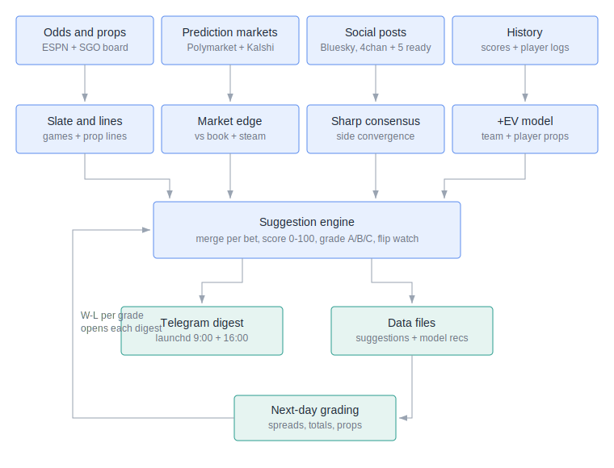
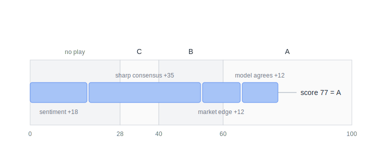

# Architecture

How sports-sentiment turns raw data into graded betting suggestions,
and how the daily loop operates.

## System flow



Four independent evidence streams feed one engine:

1. **Odds and props** — ESPN's public API (keyless) supplies the slate,
   game lines, and final scores; SportsGameOdds (`SGO_API_KEY`) supplies
   player-prop lines with both-side prices and real spread/total prices.
   ESPN backfills any games SGO lacks.
2. **Prediction markets** — Polymarket and Kalshi public APIs (keyless).
   Per game: real-money win probability, its **edge** vs the devigged
   sportsbook moneyline, and intraday **steam** (movement between runs).
3. **Social posts** — normalized into one post schema regardless of
   source. Live keyless/keyed today: Bluesky, 4chan `/sp/`. Built and
   dormant until credentials exist: Reddit, YouTube, Telegram channels,
   Threads, twitterapi.io. Every post is tiered by its author via the
   sport pack's `accounts.json` (tracked / sharp / analytics / news /
   public).
4. **History** — final scores (ESPN, incremental daily) and player game
   logs (MLB StatsAPI, cached daily) powering the +EV model.

Each stream degrades gracefully: a missing key skips its source and the
run continues with whatever is configured.

## Scoring: how a play earns its grade



Every market (game spread, total, moneyline, each player prop) starts at
zero and accumulates points from each signal that supports the pick.
Thresholds: below 28 no play, 28 grade C, 40 grade B, 60 grade A.

Additive evidence:

| Signal | Points | Notes |
|---|---|---|
| Sharp consensus (2+ accounts, same side, none opposed) | +30, +5/extra, cap 45 | mutes the buzz bonus; primary path to grade A |
| Divergence signal (fade public / follow sharp) | up to 40 | scaled by divergence size |
| Sharp buzz (2+ accounts mentioning the market) | +25 to +35 | weaker than consensus: talk, not agreement |
| Prediction-market edge agrees (>= 3%) | up to 25 | halved on thin books (< $1k volume) |
| Steam (>= 4% intraday move toward the pick) | +8 | flagged `steam` |
| +EV model agrees on the market | +12 | |
| Flip triggered (public lock -> sharp counter) | +15 | flagged `flip` |
| Sentiment magnitude / volume / sharp mentions | up to ~37 | the base layer |

Subtractive evidence and warnings:

| Signal | Points | Flag |
|---|---|---|
| 2+ sharps on the other side | -15 | `sharps-against` |
| Prediction market disagrees (>= 4%) | -10 | `market-against` |
| Model disagrees | -8 | `model-against` |
| Sharps split on the market | -5 | `sharps-split` |

Ceilings (grades are earned, not accumulated):

- Public sentiment alone caps at **C**, regardless of score.
- Prediction-market or model evidence alone caps at **B**.
- Unresolved injury news on the game caps the play at **B** and attaches
  the news to the card.
- Grade **A** requires sharp-social evidence — in practice, consensus.

Special paths:

- **Flip watch** — a market with one-sided public sentiment and zero
  sharp presence produces *no* play; it is recorded in
  `state/flip_watch.json` and only becomes a play if a later run that
  day finds sharps on the opposite side.
- **Market-only plays** — a >= 6% prediction-market/book dislocation on
  a game with no social read emits a play (6% C, ~10% B, thin halved).
- **Model-only plays** — capped at 3 per slate, never created from
  recs where the prediction market disagrees with the model
  (`pm-conflict`); the full candidate list persists in
  `data/<sport>/model/<date>.json`.

## The +EV model

Team level: offense/defense ratings from recent scoring, shrunk halfway
toward league average (`n/(n+lookback)`), additive home advantage from
mean margin (a scoring *ratio* is biased in MLB — home teams skip the
bottom 9th when leading). Totals are de-biased against the slate's
market average so the model expresses only relative views. Humility
guard: if the model disagrees with an implied price by more than 15%,
the model is presumed wrong and stays silent.

Player level (props): **empirical** — P(over) is the fraction of
qualifying games (>= 2 plate appearances for batters, starts for
pitchers) where the player cleared the line, shrunk toward the market's
no-vig probability. No parametric distribution: bursty stats (RBIs) and
playing-time mixing broke the Poisson version in live testing.

EV gates: team markets need +3% EV; props need +5% (fatter vig) and
prices within +-250. All thresholds live in the sport config.

## Daily lifecycle

Per-sport macOS LaunchAgents
(`~/Library/LaunchAgents/com.wynclaw.sports-sentiment.<sport>.plist`) run
the pipeline daily — MLB at **9:00** and **16:00**, WNBA at **9:15** and
**16:15**; if the machine is asleep at the scheduled time, launchd runs
it on wake. Logs: `logs/<sport>-launchd.log`.

Each run (`python3 -m pipeline.run --sport mlb`):

1. Slate + lines + props (SGO, ESPN fill)
2. Prediction-market signals; +EV model (history updates incrementally)
3. Social fetch across configured sources; tracked-account media
   transcribed into post text (`core/pick_extractor.py`, codex vision);
   posts matched to games/props
4. Sentiment aggregation -> alerts (news deduped, 3-day cooldown)
5. Suggestion engine -> `data/<sport>/suggestions/<date>.json` ->
   Telegram digest

The digest opens with yesterday's graded record, then the best bet,
ranked game cards (props nested, consensus 🤝 and flip 🔁 marked, news
attached), then the no-edge list, news watch, and flip-watch count.

## Grading and the record

`pipeline/grading.py` grades the previous run's suggestions on the next
run: spreads/totals/moneylines against final scores, props against the
player's actual stat line from the same game logs. Running W-L per
confidence band persists in `data/<sport>/state/record.json` and opens
every digest. This is the feedback loop for tuning every point value
above against evidence.

## Data layout

```
data/<sport>/
  queries/game_data_<date>.json   slate + lines + props
  raw/<date>.json                 game-keyed normalized posts
  sentiment/<date>.json           aggregated signals (incl. sharp_sides)
  alerts/<date>.json|.md          raw alert layer
  model/<date>.json               all +EV candidates (for backtesting)
  suggestions/<date>.json         the plays as delivered
  stats/                          score history, player index + logs
  state/                          flip watch, news cooldown, W-L record,
                                  PM snapshots
```

Everything under `data/` is gitignored runtime state.

## Adding a sport

Create `sports/<key>/config.json` (see the mlb pack for the full shape):
ESPN league path, SGO league id, Polymarket tag + Kalshi series, prop
markets with stat-API mappings, stat aliases, team keywords, subreddits,
model parameters and line-sanity gates. Optionally `accounts.json`
(tracked accounts — handles work across all sources) and player/team
maps. No code changes; NBA and NFL packs ship ready and activate when
their seasons produce slates.
